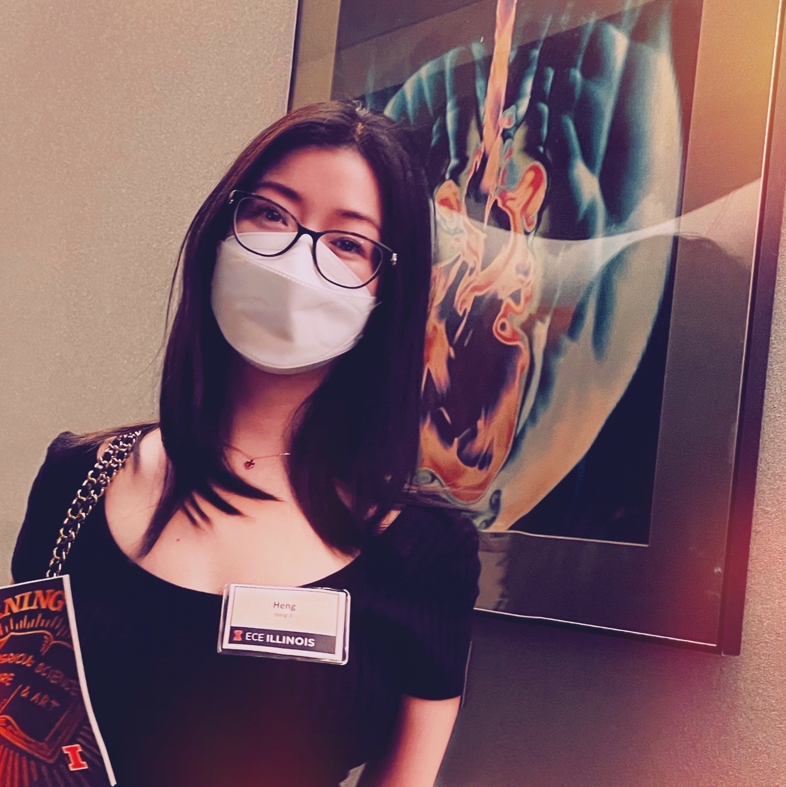

#### The Battlefront of Combating Misinformation and Coping with Media Bias

## Schedule
August 14, 2022 (Sunday)

## Table of Contents
* [Abstract](#abstract)
* [Target Audience and Prerequisites](#target-audience-and-prerequisites)
* [Outline](#outline)
  * [Background and Motivation](#background-and-motivation)
  * [Fake News Detection](#fake-news-detection-60min)
    * [Special Note on Neural Fake News Generation & Detection](#special-note-on-neural-fake-news-generation--detection)
  * [Fake News Characterization](#fake-news-characterization-30min)
  * [Corrective Actions for Misinformation and Biased News Reporting](#corrective-actions-for-misinformation-and-biased-news-reporting-30min)
    * [Industry Initiatives](#industry-initiatives)
  * [Concluding Remarks & Future Directions](#concluding-remarks--future-directions-30min)
* [Tutors](#tutors)
* [Reading List](#reading-list)

## Abstract

The growth of online platforms has greatly facilitated the way people communicate with each other and stay informed about trending events. However, it has also spawned unprecedented levels of inaccurate or misleading information, as traditional journalism gate-keeping fails to keep up with the pace of media dissemination. These undesirable phenomena have caused societies to be torn over irrational beliefs, money lost from impulsive stock market moves, and deaths occurred that could have been avoided during the COVID-19 pandemic, due to the infodemic that came forth with it, etc. Even people who do not believe the misinformation may still be plagued by the pollution of unhealthy content surrounding them, an unpleasant situation known as information disorder. Thus, it is of pertinent interest for our community to better understand, and to develop effective mechanisms for remedying, misinformation and biased reporting.

## Target Audience and Prerequisites
Based on the level of interest in this topic, we expect around 150 participants. While no specific background knowledge is assumed of the audience, it would be best for the attendees to know basic deep learning, pre-trained word embeddings (e.g., Word2Vec) and language models (e.g.,BERT).

## Outline
[Tutorial Slides](https://docs.google.com/presentation/d/1k_N9PeKx6hhdYZB73mbUi2wxiAGY0bvB/edit?usp=sharing&ouid=117303641707262995340&rtpof=true&sd=true) (Please download the slides as PowerPoint format for best viewing.)
### Background and Motivation
We begin motivating the tutorial topic with a selection of real-world examples of fake news and their harmful impacts to society, followed by a pedagogical exercise of how humans tend to approach the problem of fake news detection, characterization, and correction. We will point out conceptual distinctions amongst various types of fake news, including serious fabrication in news journalism about misattributed or nonexisting events, over-sensationalized clickbaits, hoaxes which are false with the intention to be picked up by traditional news websites and satire which mimic genuine news but contain irony and absurdity. For example, in general, news articles more likely involve serious fabrications, while social media posts involve more humour such as satire and hoaxes. We will also describe the cognitive, social and affective factors that lead people to form or endorse misinformed views (e.g., intuitive thinking, illusory truths, source cues, emotions, etc.), and the psychological barriers to knowledge revision after misinformation has been corrected, including correction not integrated, selective retrieval, and continued influence theories. 

### Fake News Detection (60min)

Bearing in mind the different categories and psychological drivers of misinformation, we introduce detection based on:

* **stylistic** approaches that focus on lexical features, readability, and syntactic clues.
* **fact-checking** approaches that compare check-worthy content with background knowledge, such as external knowledge bases (FreeBase, WikiBase, etc) and previously fact-checked claims.
* **semantic-consistency** approaches that extract features related to single-document discourse-level coherence and cross-document event-centric coherence in text. Extending to cross-media domain, the common strategy is to check text-image consistency and text-video consistency
* **propagation patterns** that capture confounding factors from the dynamics of how a news topic spreads and the social network interactions . 

We will discuss the merits and the limitations of these different lines of fake news detection approaches. For example, fact-checking approaches may not fare well for early rumours or breaking news not yet groundable to an established background knowledge, in which case, the credibility of the news source can offer complementary assistance. Stylistic approaches may be simple but yet effective for detecting low-quality human-written fake news, but not so good for machine-generated misinformation, which is stylistically consistent regardless of the underlying motives.
We then cover recent approaches that leverage a combination of these elements for greater representation power and robustness. Importantly, we also cover works that explore the diachronic bias of fake news detection and portability across data in different time and language settings.

#### Special Note on Neural Fake News Generation & Detection:
Advancements in natural language generation spawn the rise of news generation models which represent a double-edged sword. On one hand, malicious actors may irresponsibility take advantage of the technology to influence opinions and gain revenue. But, on the other hand, it can also be used as
a source of machine-synthesized  training data for detector models to overcome data scarcity since real-world fake news tends to be eventually removed by platforms, as well as a tool for threat modeling to develop proactive defenses against potential threats. We review how popular detectors perform on fake news created from large-scale language and vision generator model. We also review progress in generating fake news that better aligns with the key topic and facts, and work towards applying topic/fact-constrained fake news generation to construct silver-standard data annotations for finer-grained fake news detection.

### Fake News Characterization (30min)
To better understand and fight fake news, we next address some fundamental questions of characterizing fake news based on underlying source bias, reporting agenda, propaganda techniques, and target audience. First, we introduce modeling approaches for detecting political and socio-cultural biases in news articles. Next, we introduce the recent EMU benchmark that require models to answer open-ended questions capturing the intent and the implications of a media edit. We cover methodologies for identifying the specific propaganda techniques used, e.g., _smears_, _glittering generalities_, _association transfer_, etc. We also discuss the latest explorations in predicting the intended target of harmful media content, e.g., the person, the organization, the community, or the society level. 

### Corrective Actions for Misinformation and Biased News Reporting (30min)
After misinformation has been detected and categorized based on its various characteristics, there is naturally follow-up interest in corrective explanations on why a piece of information is fake or misleading, and how to report less biased and more comprehensive news in general. Hence, we cover frameworks for explaining why a given piece of news is actually fake news through the leverage of reader comments, as well as appropriate strategies for placing the corrective explanations based on user studies. We also cover research on mitigating media bias, such as through neutral article generation.

#### Industry Initiatives:
We further point out recent actions by tech companies with media-hosting platforms for fighting fake news. With urges from the government, they experiment with removing economic incentives for traffickers of misinformation, promoting media literacy, suspending improper posts and accounts, and adding colored labels, with corrections constructed from a community-based point system similar to Wikipedia, directly beneath misinformation posted by public figures (https://www.nbcnews.com/tech/tech-news/twitter-testing-new-ways-fight-misinformation-including-community-based-points-n1139931).

### Concluding Remarks & Future Directions (30min)
Finally, we summarize the major remaining challenges in this space, including the detection of subtle inconsistencies, enforcing schema or logical constraints in the detection, identifying semantically consistent but misattributed cross-media pairings, and greater precision in fine-grained explanations for the detected misinformation.

## Tutors

     

**Yi R. Fung** is a second-year Ph.D. student at the Computer Science Department of UIUC, with research interests in knowledge reasoning, misinformation detection, and computation for the social good. Her recent works include the InfoSurgeon fake news detection framework, and multiview news summarization. Yi is a recipient of the NAACL'21 Best Demo Paper, the UIUC Lauslen and Andrew fellowship, and the National Association of Asian American Professionals Future Leaders award. She has also been previously selected for invited talk (1 hour presentation) at the Harvard Medical School Bioinformatics Seminar. Additional information is available at [https://yrf1.github.io](https://yrf1.github.io).

     

**Kung-Hsiang Huang** is a first-year Ph.D. student at the Computer Science Department of UIUC. His research focuses on fact-checking and fake news detection. Prior to joining UIUC, he obtained his B.Eng. in Computer Science from the Hong Kong University of Science and Technology, and his M.S. in Computer Science from USC. He is also a co-founder of an AI startup, Rosetta.ai. Additional information is available at [https://khuangaf.github.io](https://khuangaf.github.io).

     

**Preslav Nakov** is a Principal Scientist at the Qatar Computing Research Institute (QCRI), HBKU, who received his PhD degree from the University of California at Berkeley (supported by a Fulbright grant). Dr. Nakov is President of ACL SIGLEX, Secretary of ACL SIGSLAV, a member of the EACL advisory board, as well as a member of the editorial board of Computational Linguistics, TACL, CS&L, IEEE TAC, NLE, AI Communications, and Frontiers in AI. His research on fake news was featured by over 100 news outlets, including Forbes, Boston Globe, Aljazeera, MIT Technology Review, Science Daily, Popular Science, The Register, WIRED, and Engadget, among others. He has driven relevant tutorials such as:

* WSDM’22: Fact-Checking, Fake News, Propaganda, Media Bias, and the COVID-19 Infodemic.
* CIKM'21: Fake News, Disinformation, Propaganda, and Media Bias.
* EMNLP'20: Fact-Checking, Fake News, Propaganda, and Media Bias: Truth Seeking in the Post-Truth Era.

Additional information is available at [https://en.wikipedia.org/wiki/Preslav_Nakov](https://en.wikipedia.org/wiki/Preslav_Nakov).

     

**Heng Ji**  is a Professor at the Computer Science Department of the University of Illinois Urbana-Champaign, and an Amazon Scholar. Her research interests focus on NLP, especially on Multimedia Multilingual Information Extraction, Knowledge Base Population and Knowledge-driven Generation. She was selected as "Young Scientist" and a member of the Global Future Council on the Future of Computing by the World Economic Forum. The awards she received include "AI's 10 to Watch" Award, NSF CAREER award, Google Research Award, IBM Watson Faculty Award, Bosch Research Award, Amazon AWS Award, ACL2020 Best Demo Paper Award, and NAACL2021 Best Demo Paper Award. She has given a large number of keynotes and 20 tutorials on Information Extraction, Natural Language Understanding, and Knowledge Base Construction in many conferences including but not limited to ACL, EMNLP, NAACL, NeurIPS, AAAI, SIGIR, WWW, IJCAI, COLING and KDD. A selected handful of her recent tutorials include:

* AAAI’22: Deep Learning on Graphs for Natural Language Processing.
* EMNLP’21: Knowledge-Enriched Natural Language Generation.
* ACL’21: Event-Centric Natural Language Processing.

## Reading List
### Fake News Detection

#### Style

1. [The language of legal and illegal activity on the Darknet](https://aclanthology.org/P19-1419/). Leshem Choshen, Dan Eldad, Daniel Hershcovich, Elior Sulem, Omri Abend. ACL 2019
2. [Automatic detection of fake news](https://aclanthology.org/C18-1287/). Verónica Pérez-Rosas, Bennett Kleinberg, Alexandra Lefevre, Rada Mihalcea. COLING 2018
3. [Truth of varying shades: Analyzing language in fake news and political fact-checking](https://aclanthology.org/D17-1317/). Hannah Rashkin, Eunsol Choi, Jin Yea Jang, Svitlana Volkova, Yejin Choi. EMNLP 2017.
4. [This Just In: Fake News Packs a Lot in Title, Uses Simpler, Repetitive Content in Text Body, More Similar to Satire than Real News](https://arxiv.org/abs/1703.09398). Benjamin D. Horne, Sibel Adali. Arxiv 2017.

#### Fact Checking

1. [Predicting factuality of reporting and bias of news media sources](https://aclanthology.org/D18-1389/). Ramy Baly, Georgi Karadzhov, Dimitar Alexandrov, James Glass, Preslav Nakov. EMNLP 2018
2. [A survey on automated fact-checking](https://direct.mit.edu/tacl/article/doi/10.1162/tacl_a_00454/109469/A-Survey-on-Automated-Fact-Checking). Zhijiang Guo, Michael Schlichtkrull, Andreas Vlachos. TACL 2022
3. [Compare to the knowledge: Graph neural fake news detection with external knowledge](https://aclanthology.org/2021.acl-long.62/). Linmei Hu, Tianchi Yang, Luhao Zhang, Wanjun Zhong, Duyu Tang, Chuan Shi, Nan Duan, Ming Zhou. ACL 2021 
4. [That is a known lie: Detecting previously fact-checked claims](https://aclanthology.org/2020.acl-main.332/). Shaden Shaar, Nikolay Babulkov, Giovanni Da San Martino, Preslav Nakov. ACL 2020
5. [Fact or Fiction: Verifying Scientific Claims](https://aclanthology.org/2020.emnlp-main.609/). David Wadden, Shanchuan Lin, Kyle Lo, Lucy Lu Wang, Madeleine van Zuylen, Arman Cohan, Hannaneh Hajishirzi. EMNLP 2020
6. [FEVER: a Large-scale Dataset for Fact Extraction and VERification](https://aclanthology.org/N18-1074/). James Thorne, Andreas Vlachos, Christos Christodoulopoulos, Arpit Mittal. NAACL 2018
7. [COVID-Fact: Fact Extraction and Verification of Real-World Claims on COVID-19 Pandemic](https://aclanthology.org/2021.acl-long.165/). Arkadiy Saakyan, Tuhin Chakrabarty, Smaranda Muresan. ACL 2021
8. [“Liar, Liar Pants on Fire”: A New Benchmark Dataset for Fake News Detection](https://aclanthology.org/P17-2067/). William Yang Wang. ACL 2017
9. [X-Fact: A New Benchmark Dataset for Multilingual Fact Checking](https://aclanthology.org/2021.acl-short.86/). Ashim Gupta, Vivek Srikumar. ACL 2021
10. [Integrating Stance Detection and Fact Checking in a Unified Corpus](https://aclanthology.org/N18-2004/). Ramy Baly, Mitra Mohtarami, James Glass, Lluís Màrquez, Alessandro Moschitti, Preslav Nakov. NAACL 2018
11. [Stance Prediction and Claim Verification: An Arabic Perspective](https://aclanthology.org/2020.fever-1.2/). Jude Khouja. FEVER 2020 
12. [Joint Rumour Stance and Veracity Prediction](https://aclanthology.org/W19-6122/). Anders Edelbo Lillie, Emil Refsgaard Middelboe, Leon Derczynski. NoDaLiDa 2019
13. [DanFEVER: claim verification dataset for Danish](https://aclanthology.org/2021.nodalida-main.47/) Jeppe Nørregaard, Leon Derczynski. NoDaLiDa 2021
14. [MultiFC: A Real-World Multi-Domain Dataset for Evidence-Based Fact Checking of Claims](https://aclanthology.org/D19-1475/) Isabelle Augenstein, Christina Lioma, Dongsheng Wang, Lucas Chaves Lima, Casper Hansen, Christian Hansen, Jakob Grue Simonsen. EMNLP 2019 
15. [Towards Debiasing Fact Verification Models](https://aclanthology.org/D19-1341/). Tal Schuster, Darsh Shah, Yun Jie Serene Yeo, Daniel Roberto Filizzola Ortiz, Enrico Santus, Regina Barzilay. EMNLP 2019
16. [End-to-End Bias Mitigation by Modelling Biases in Corpora](https://aclanthology.org/2020.acl-main.769/). Rabeeh Karimi Mahabadi, Yonatan Belinkov, James Henderson. ACL 2020
17. [Mind the Trade-off: Debiasing NLU Models without Degrading the In-distribution Performance](https://aclanthology.org/2020.acl-main.770/). Prasetya Ajie Utama, Nafise Sadat Moosavi, Iryna Gurevych. ACL 2020
18. [Scientific Claim Verification with VerT5erini](https://aclanthology.org/2021.louhi-1.11/). Ronak Pradeep, Xueguang Ma, Rodrigo Nogueira, Jimmy Lin. LOUHI 2021
19. [Dense Passage Retrieval for Open-Domain Question Answering](https://aclanthology.org/2020.emnlp-main.550/). Vladimir Karpukhin, Barlas Oguz, Sewon Min, Patrick Lewis, Ledell Wu, Sergey Edunov, Danqi Chen, Wen-tau Yih. EMNLP 2020
20. [What Was Written vs. Who Read It: News Media Profiling Using Text Analysis and Social Media Context](https://aclanthology.org/2020.acl-main.308/). Ramy Baly, Georgi Karadzhov, Jisun An, Haewoon Kwak, Yoan Dinkov, Ahmed Ali, James Glass, Preslav Nakov. ACL 2020
21. [Generating Fact Checking Explanations](https://aclanthology.org/2020.acl-main.656/). Pepa Atanasova, Jakob Grue Simonsen, Christina Lioma, Isabelle Augenstein. ACL 2020
22. [Explainable Automated Fact-Checking for Public Health Claims](https://aclanthology.org/2020.emnlp-main.623/). Neema Kotonya, Francesca Toni. EMNLP 2020

#### Semantic Consistency

1. [Learning hierarchical discourse-level structure for fake news detection](https://aclanthology.org/N19-1347/). Hamid Karimi, Jiliang Tang. NAACL 2019
2. [Cross-document misinformation detection based on event graph reasoning](https://aclanthology.org/2022.naacl-main.40/). Xueqing Wu, Kung-Hsiang Huang, Yi Fung, Heng Ji. NAACL 2022
3. [Cosmos: Catching out-of-context misinformation with self-supervised learning](https://arxiv.org/abs/2101.06278). Shivangi Aneja, Chris Bregler, Matthias Nießner. Arxiv, 2021
4. [Text-Image De-Contextualization Detection Using Vision-Language Models](https://ieeexplore.ieee.org/document/9746193). Mingzhen Huang, Shan Jia, Ming-Ching Chang, Siwei Lyu. ICASSP 2022
5. [Detecting cross-modal inconsistency to defend against neural fake news](https://aclanthology.org/2020.emnlp-main.163/). Reuben Tan, Bryan Plummer, Kate Saenko. EMNLP 2020
6. [Misinformation detection in social media video posts](https://arxiv.org/abs/2202.07706). Kehan Wang, David Chan, Seth Z. Zhao, J. Canny, A. Zakhor. Arxiv 2022
7. [Compare to The Knowledge: Graph Neural Fake News Detection with External Knowledge](https://aclanthology.org/2021.acl-long.62/). Linmei Hu, Tianchi Yang, Luhao Zhang, Wanjun Zhong, Duyu Tang, Chuan Shi, Nan Duan, Ming Zhou. ACL 2021
8. [Learning Transferable Visual Models From Natural Language Supervision](https://icml.cc/media/icml-2021/Slides/9193.pdf).Alec Radford, Jong Wook Kim, Chris Hallacy, A. Ramesh, Gabriel Goh, Sandhini Agarwal, Girish Sastry, Amanda Askell, Pamela Mishkin, Jack Clark, Gretchen Krueger, Ilya Sutskever. ICML  2021
9. [NewsCLIPpings: Automatic Generation of Out-of-Context Multimodal Media](https://aclanthology.org/2021.emnlp-main.545/). Grace Luo, Trevor Darrell, Anna Rohrbach. EMNLP 2021
10. [Fine-Grained Visual Entailment](https://arxiv.org/abs/2203.15704). Christopher Thomas, Yipeng Zhang, Shih-Fu Chang. ECCV 2022

#### Propagation Patterns

1. [Causal understanding of fake news dissemination on social media](https://dl.acm.org/doi/10.1145/3447548.3467321). Lu Cheng, Ruocheng Guo, Kai Shu, Huan Liu. KDD 2021
2. [GCAN: Graph-aware co-attention networks for explainable fake news detection on social media](https://aclanthology.org/2020.acl-main.48/). Yi-Ju Lu, Cheng-Te Li. ACL 2020
3. [Hierarchical propagation networks for fake news detection: Investigation and exploitation](https://ojs.aaai.org/index.php/ICWSM/article/view/7329). Kai Shu, Deepak Mahudeswaran, Suhang Wang, Huan Liu. ICWSM 2020
4. [FakeNewsNet: A Data Repository with News Content, Social Context, and Spatiotemporal Information for Studying Fake News on Social Media](https://pubmed.ncbi.nlm.nih.gov/32491943/). Kai Shu, Deepak Mahudeswaran, Suhang Wang, Dongwon Lee, Huan Liu. Big Data 2020
5. [FANG: Leveraging Social Context for Fake News Detection Using Graph Representation](http://dl.acm.org/citation.cfm?id=3412046). Van-Hoang Nguyen, Kazunari Sugiyama, Preslav Nakov, Min-Yen Kan. CIKM 2020

#### Special notes on Fake News Generation

1. [Defending against neural fake news](https://proceedings.neurips.cc/paper/2019/file/3e9f0fc9b2f89e043bc6233994dfcf76-Paper.pdf). Rowan Zellers, Ari Holtzman, Hannah Rashkin, Yonatan Bisk, Ali Farhadi, Franziska Roesner, Yejin Choi. NeurIPS 2019.
2. [Protecting world leaders against deep fakes](https://openaccess.thecvf.com/content_CVPRW_2019/html/Media_Forensics/Agarwal_Protecting_World_Leaders_Against_Deep_Fakes_CVPRW_2019_paper.html). Shruti Agarwal, Hany Farid, Yuming Gu, Mingming He, Koki Nagano, Hao Li. CVPR Workshops 2019.
3. [Deepfake video detection using recurrent neural networks](https://ieeexplore.ieee.org/document/8639163/). David Guera, E. Delp. AVSS 2018.
4. [InfoSurgeon: Cross-media fine-grained information consistency checking for fake news detection](https://aclanthology.org/2021.acl-long.133/). Yi Fung, Christopher Thomas, Revanth Gangi Reddy, Sandeep Polisetty, Heng Ji, Shih-Fu Chang, Kathleen McKeown, Mohit Bansal, Avi Sil. ACL 2021
5. [Fact-enhanced synthetic news generation](https://ojs.aaai.org/index.php/AAAI/article/view/17629). Kai Shu, Yichuan Li, Kaize Ding, Huan Liu. AAAI 2021
6. [Faking Fake News for Real Fake News Detection: Propaganda-loaded Training Data Generation](https://arxiv.org/abs/2203.05386). Kung-Hsiang Huang, Kathleen McKeown, Preslav Nakov, Yejin Choi, Heng Ji. Arxiv 2022

### Fake News Characterization

1. [In plain sight: Media bias through the lens of factual reporting](https://aclanthology.org/D19-1664/). Lisa Fan, Marshall White, Eva Sharma, Ruisi Su, Prafulla Kumar Choubey, Ruihong Huang, Lu Wang .EMNLP 2019
2. [Social chemistry 101: Learning to reason about social and moral norms](https://aclanthology.org/2020.emnlp-main.48/). Maxwell Forbes, Jena D. Hwang, Vered Shwartz, Maarten Sap, Yejin Choi. EMNLP 2020
3. [Multi-view models for political ideology detection of news articles](https://aclanthology.org/D18-1388/). Vivek Kulkarni, Junting Ye, Steve Skiena, William Yang Wang. EMNLP 2018
4. [Edited media understanding frames: Reasoning about the intent and implications of visual misinformation](https://aclanthology.org/2021.acl-long.158/). Jeff Da, Maxwell Forbes, Rowan Zellers, Anthony Zheng, Jena D. Hwang, Antoine Bosselut, Yejin Choi. ACL 2021
5. [Detecting propaganda techniques in memes](https://aclanthology.org/2021.acl-long.516/). Dimitar Dimitrov, Bishr Bin Ali, Shaden Shaar, Firoj Alam, Fabrizio Silvestri, Hamed Firooz, Preslav Nakov, Giovanni Da San Martino. ACL 2021
6. [MOMENTA: A multimodal framework for detecting harmful memes and their targets](https://aclanthology.org/2021.findings-emnlp.379/). Shraman Pramanick, Shivam Sharma, Dimitar I. Dimitrov, Md. Shad Akhtar, Preslav Nakov, Tanmoy Chakraborty. Findings of EMNLP 2021
7. [Truth of Varying Shades: Analyzing Language in Fake News and Political Fact-Checking](https://aclanthology.org/D17-1317/). Hannah Rashkin, Eunsol Choi, Jin Yea Jang, Svitlana Volkova, Yejin Choi. EMNLP 2017

### Corrective Actions for Misinformation and Biased News Reporting

1. [Timing matters when correcting fake news](https://www.pnas.org/doi/full/10.1073/pnas.2020043118). Nadia M. Brashier, Gordon Pennycook, A. Berinsky, David G. Rand. PNAS 2021
2. [dEFEND: Explainable fake news
detection](https://dl.acm.org/doi/10.1145/3292500.3330935). Kai Shu, Limeng Cui, Suhang Wang, Dongwon Lee, Huan Liu. KDD 2019
3. [NeuS: Neutral Multi-News Summarization for Mitigating Framing Bias](https://aclanthology.org/2022.naacl-main.228.pdf). Nayeon Lee, Yejin Bang, Tiezheng Yu, Andrea Madotto, Pascale Fung. NAACL 2022

Additional information is available at [https://blender.cs.illinois.edu/hengji.html](https://blender.cs.illinois.edu/hengji.html).

For more information about this tutorial, please refer to our [proposal](https://blender.cs.illinois.edu/paper/misinfotutorial2022.pdf).
